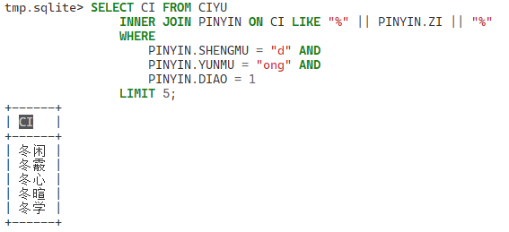
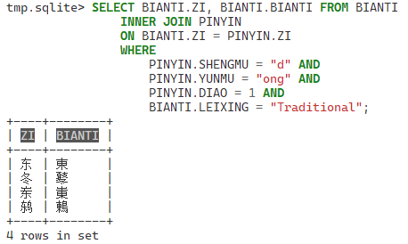

# 文书DB
文书DB是一个柠檬在制作柠檬五码的时候的副产物，
柠檬在写柠檬五码的时候碰到了一个问题，现有的互联网上的中文字，拆字，读音，词典，相近字，异性字，笔画等没有一个完美的整合方案，而这个就是我理想中的解决方案。

因为爬虫和洗数据的过程比较恶心而且有可能不合规，于是我决定不开源爬虫和清洗数据用的代码。

~~不小心爬崩了无数个网站欸嘿~~
## 使用要求？
懂SQLite怎么用就行，相信大部分开发者都可以轻松上手。

## 依赖
我没写`requirements`因为相信这几个也没什么好装的。
```
pandas
pypinyin
sqlite3
```
## 样例
- 下图中我查询所有`dong1`可以构成的词语

- 下图中我查询所有`dong1`的简繁对照



# Sqlite 文档

## 拼音表 `PINYIN`
| 中文 | SQL列   |
| ---- | ------- |
| ~    | ID      |
| 声母 | SHENGMU |
| 韵母 | YUNMU   |
| 音调 | DIAO    |
| 字   | ZI      |

## 粤拼表 `JYUTPING`
| 中文 | SQL列   |
| ---- | ------- |
| ~    | ID      |
| 声母 | SHENGMU |
| 韵母 | YUNMU   |
| 韵尾 | YUNWEI  |
| 音调 | DIAO    |
| 字   | ZI      |

## 拆字表 `CHAIZI`
| 中文 | SQL列 |
| ---- | ----- |
| ~    | ID    |
| 字   | ZI    |
| 拆   | CHAI  |
| 顺序 | XU    |

大概是这样的
```sql
SELECT * FROM CHAIZI WHERE ZI = '好';
```
```
ID | 好 | 女 | 1
ID | 好 | 子 | 2
```

## 笔画表 `BIHUA`
多用于排序
| 中文 | SQL列 |
| ---- | ----- |
| ~    | ID    |
| 字   | ZI    |
| 笔画 | BIHUA |

## 字频表 `ZIPIN`
多用于排序
| 中文 | SQL列 |
| ---- | ----- |
| ~    | ID    |
| 字   | ZI    |
| 频率 | PINLV |

## 变体表 `BIANTI`
| 中文     | SQL列   |
| -------- | ------- |
| ~        | ID      |
| 字       | ZI      |
| 变体类型 | LEIXING |
| 变体     | BIANTI  |

## 英文含义表 `DEFINITION`
| 中文     | SQL列      |
| -------- | ---------- |
| ~        | ID         |
| 字       | ZI         |
| 英文含义 | DEFINITION |

## 康熙字典表 `KANGXI`
| 中文 | SQL列 |
| ---- | ----- |
| ~    | ID    |
| 字   | ZI    |
| 卷   | JUAN  |
| 部   | BU    |
| 页   | YE    |
| 义   | YI    |

## 词语表 `CIYU`
| 中文 | SQL列  |
| ---- | ------ |
| ~    | ID     |
| 词   | CI     |
| 拼音 | PINYIN |
| 含义 | YI     |
| 源   | YUAN   |
| 例   | LI     |

## 歇后语表 `XIEHOUYU`
| 中文   | SQL列    |
| ------ | -------- |
| ~      | ID       |
| 歇后语 | XIEHOUYU |
| 解释   | JIESHI   |

## 数字表 `SHUZI`
| 中文     | SQL列 |
| -------- | ----- |
| ~        | ID    |
| 中文数字 | ZI    |
| 中文数字 | SHU   |

# 鸣谢
- 感谢 [@OverflowCat](https://github.com/OverflowCat) 的支持
- 感谢 [@CodeHz](https://github.com/codehz) 佬帮忙编译windows版本的sqlite3
